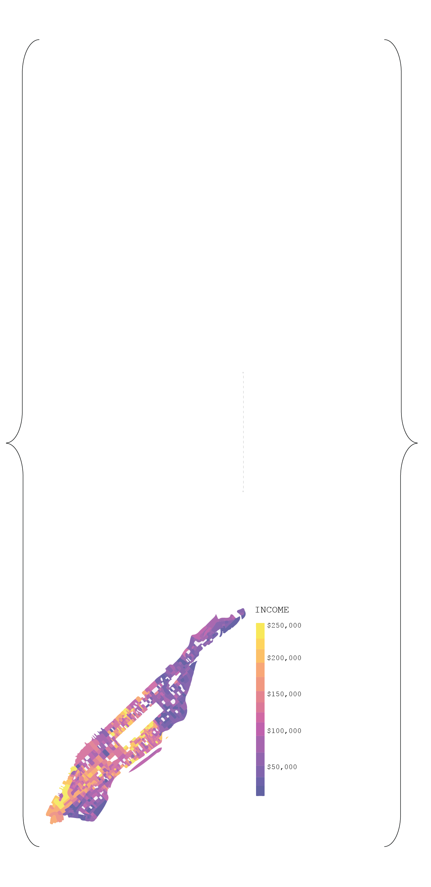

# Manhattan Spatial Data

Code assembled for Urban Conditions and Spatial Determinents of Health, Advanced Architectural Studio at the Spitzer School of Architecture.

Used in conjunction with US Census data, Socrata API and NYC's Opendata source.

Code uses ```pandas```,```numpy```, ```sodapy``` and ```cenpy``` organize the population variants within Manhattan per household, such as income. This code speculates the correlation between neighborhood income, respiratory illnesses, lack of health insurance, rate of disease, mental illness and obesity.

Using ```geopandas```, and ```matplotlib```, this correlation was visualized.

[Full project can be seen here.](https://tanhatabassum.com/spatial-determinants-of-cities)


